

  

<h1 align="center">DirDeck</h1>

<strong>文件管理界的瑞士军刀。</strong>

像浏览器一样管理，像瑞士军刀一样处理。 专为 Mac 打造的一站式文件管理工作台。

  <a href="https://dirdeck.com/">访问官网</a> ·
  <a href="https://apps.apple.com/cn/app/dirdeck/id6794571378?mt=12">Mac App Store 下载</a> ·
  <a href="https://github.com/fuxiaoai/dirdeck-community/issues/new/choose">反馈与建议</a>

macOS 15 或更高版本 · 7 天全功能试用 · 无需注册账号

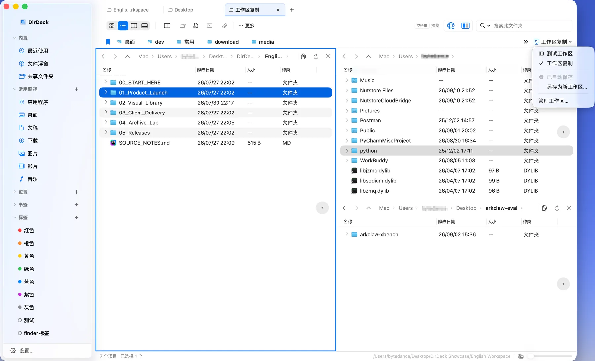

多标签页、多层级收藏夹、12 种分屏布局，让常用位置各就各位。图片水印、压缩裁切、PDF 处理、批量重命名，配合按文件类型提供的右键操作，选中文件就能开工。

超级预览看内容，文件浮窗随手取用。从找到文件、看清内容，到整理和交付，DirDeck 把这些日常操作放在同一个工作台里。

  <a href="#browser">标签与收藏</a> · <a href="#workspace">分屏与工作区</a> ·
  <a href="#preview">超级预览</a> · <a href="#tools">内置工具</a> 
  <a href="#floating">文件浮窗</a> · <a href="#mac">Mac 与网络位置</a> ·
  <a href="#customize">自定义操作</a> · <a href="#search">DD 搜索</a>

## 像管理浏览器一样，管理你的文件

一个项目一个标签页。把参考资料、正在修改的文件和待交付目录分别打开，切换时各自的位置还在，不必让一堆独立窗口占满桌面。

常用文件和文件夹都能加入收藏，再按项目、客户或用途层层归类。多级嵌套让收藏保持清楚，拖拽就能调整层级与顺序；展开收藏夹，直接到达常去的位置。

**标签页留住眼前的工作，层级收藏夹留住常去的位置。**

## 一个标签页，还能继续分屏

整理素材时，把项目放在左边、素材放在右边；准备交付时，再留一个窗格给输出目录。**12 种布局、1–4 个窗格**，可以根据手头的工作切换，并调整空间与比例。

每个窗格保留自己的浏览位置。多个位置同时可见，对照内容、选择文件、跨窗格拖放，都不必来回寻找被挡住的窗口。

### 这份工作，下次接着来

把常用目录、标签页和窗格布局保存为 **工作区**。工作区持续自动保存，再回来时接着用，不必从头摆一遍。

首图展示的就是这样的工作现场：目录分开浏览，标签随时切换，常用位置留在收藏栏里。

## 先看清，再动手

一份素材包，不必解压才知道里面有什么。选中文件夹或压缩包，按下 **空格**，从目录一路看到图片、文档和视频。

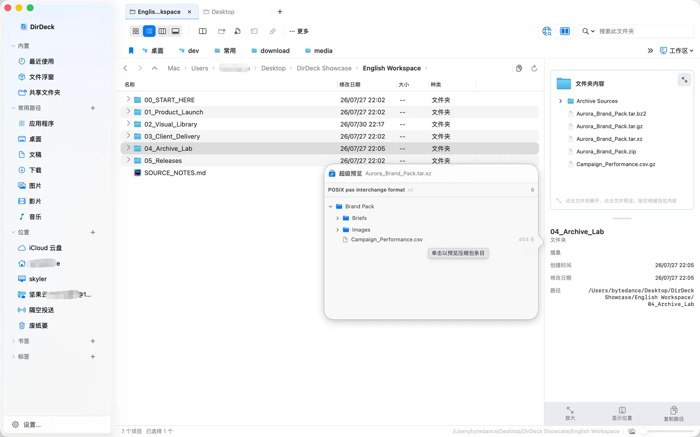

文件夹可以直接浏览层级；压缩包也像目录一样逐层展开。找到想要的文件，就接着查看内容，不必先解压整个压缩包，也不用为每一层目录打开新窗口。

<strong>看看压缩包如何逐层展开</strong>

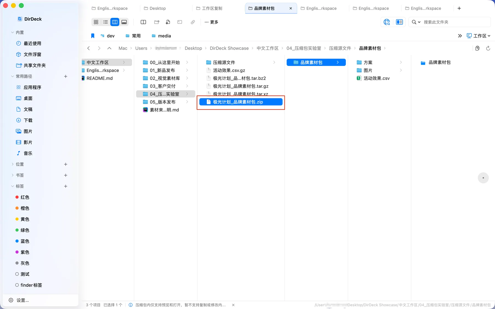

### 100+ 种常见文件格式，选中就能看

| 内容 | 预览方式 |
| --- | --- |
| 文件夹与压缩包 | 浏览层级和文件列表，继续查看其中支持预览的文件 |
| PDF 与文档 | 查看正文与 PDF 页面缩略图 |
| Excel 与表格 | 查看表格，切换工作簿中的多个 Sheet |
| Markdown 与本地网页 | 直接看排版后的内容 |
| 文本与代码 | 就地查看文本、配置和代码文件 |
| 图片、音频与视频 | 查看图片，直接播放支持的媒体文件 |

预览能力随文件格式而异；部分格式依赖 macOS 及预览组件支持。

## 接下来要做的，右键就能办

给图片加水印，把几页 PDF 单独交付，或把一批素材命名整齐。常用处理就在文件旁边，不用为每件小事再找一个工具。

### 图片：从裁切到交付

裁剪、旋转、格式转换、压缩、加水印、移除背景，还能把多张图片创建为 PDF。需要检查照片位置时，也可以查看或清除位置元数据。

### PDF：需要哪几页，就处理哪几页

拆分、合并、提取页面、压缩与旋转；对方需要图片时，可以直接将 PDF 页面导出为图片。

<strong>查看 PDF 工具</strong>

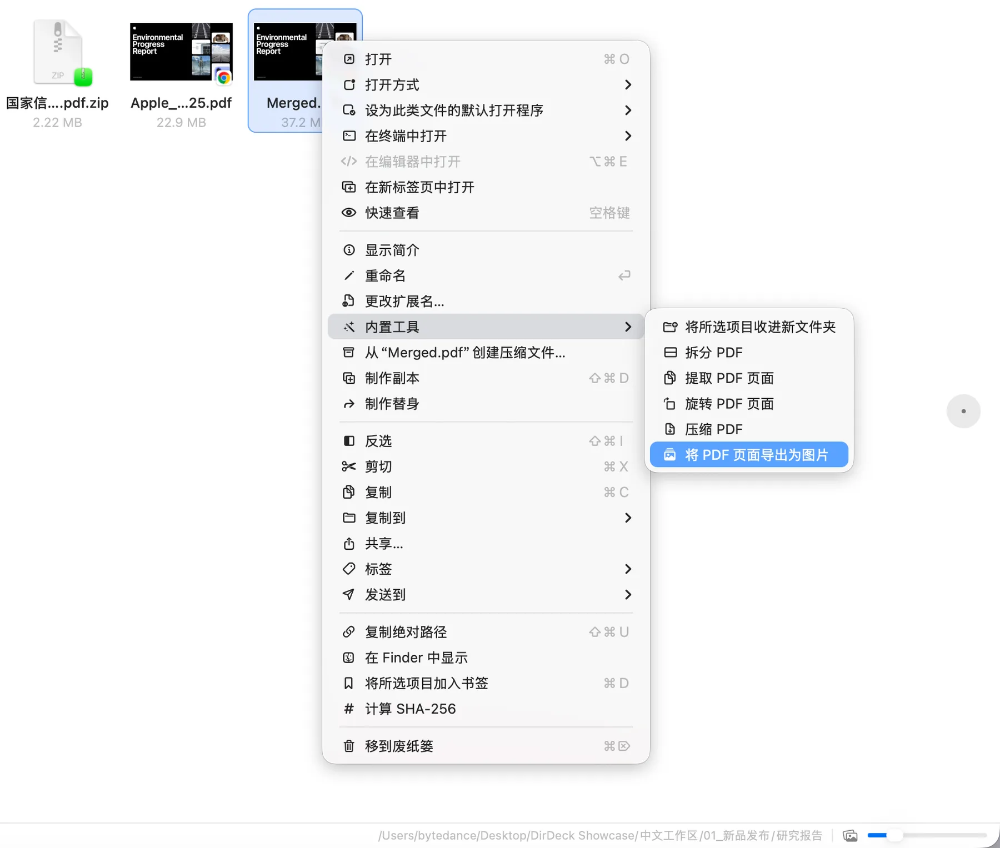

### 批量重命名：先看结果，再一次应用

把替换、前后缀、编号等规则组合起来，执行前检查完整的新文件名。一批素材采用统一命名时，不必逐个修改。

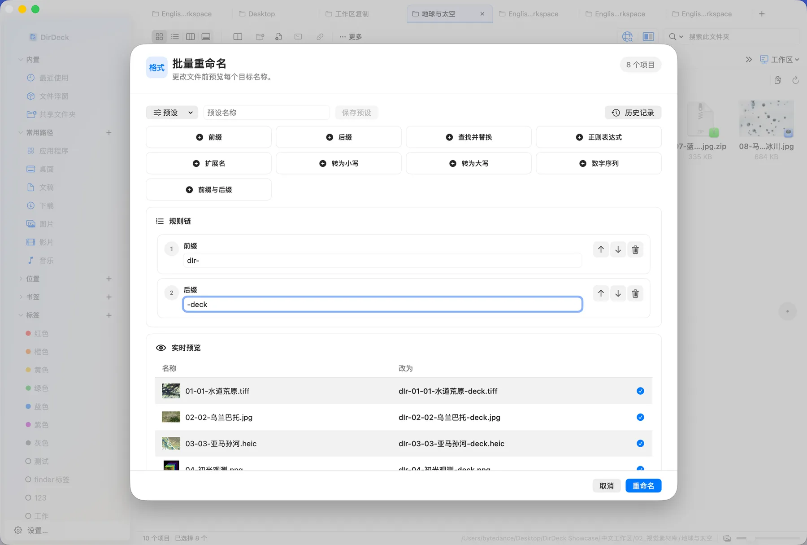

### 压缩与打包：发送之前，直接准备好

选择压缩格式，按需要设置密码或分卷大小，再把要发送的文件打包。浏览压缩包和创建压缩包，都在文件工作流程里完成。

<strong>查看加密与分卷打包</strong>

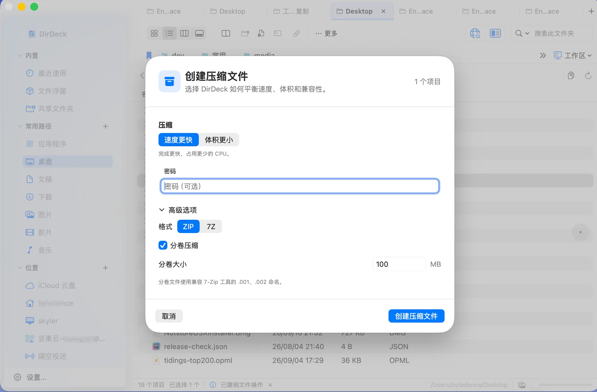

## 拿个文件，不必打断手头的事

鼠标移到屏幕顶部灵动岛或屏幕侧边，即可唤出 **文件浮窗**。下载、暂存和常用目录随手可取，找到文件直接拖出，继续手头的工作。

浮窗里可以浏览目录、预览内容、复制与拖放。写文档要插入一张图，或聊天时需要发送一个文件，都能从这里取用。

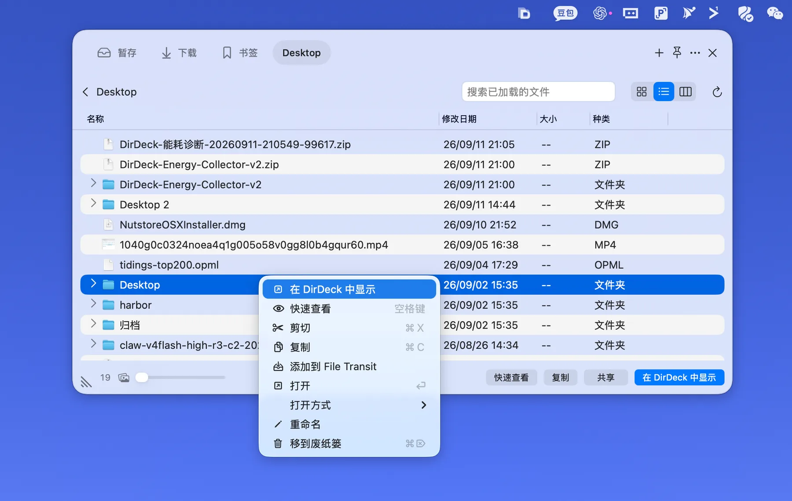

### 少挪一点鼠标

每个分栏都有自己的 **悬浮球**。后退、返回上一级、收纳或压缩文件，常用动作交给双击和悬停，按自己的习惯配置。

<strong>查看分栏悬浮球</strong>

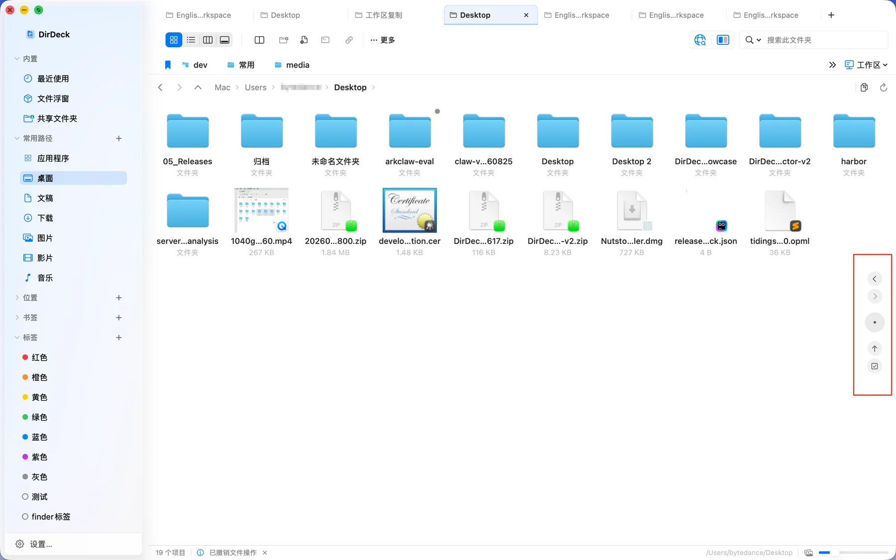

## 你的 Mac，还是熟悉的用法

### Finder 的收藏与标签，接着用

导入 Finder 的常用位置，继续使用已有标签。熟悉的目录留在手边，进入 DirDeck 后不必重新组织一套。

<strong>查看 Finder 收藏导入</strong>

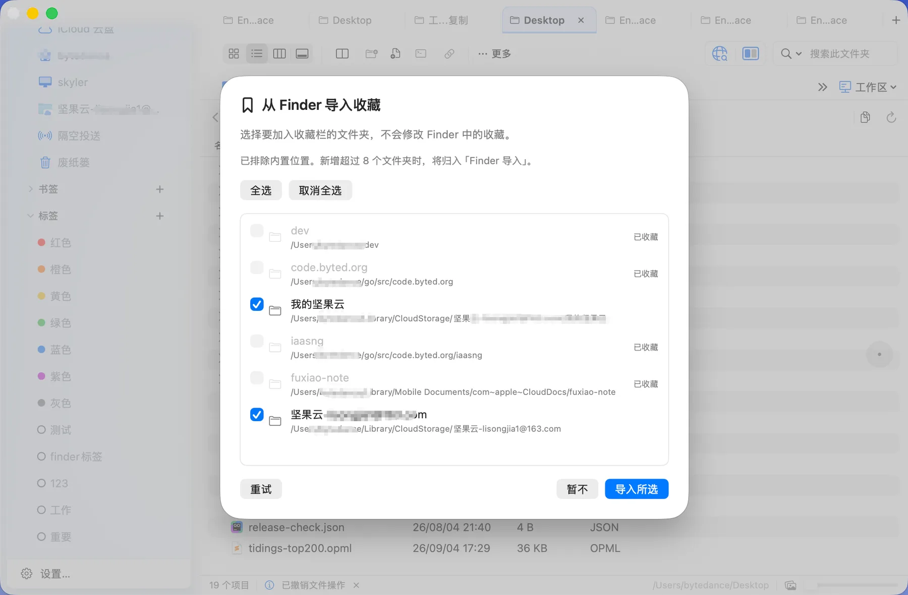

### 本地文件与网络位置，一起管理

支持 **SMB、AFP、NFS、WebDAV 和只读 FTP**。本地目录与网络位置可以放在同一套文件工作流程里，连接与授权由 macOS 处理。

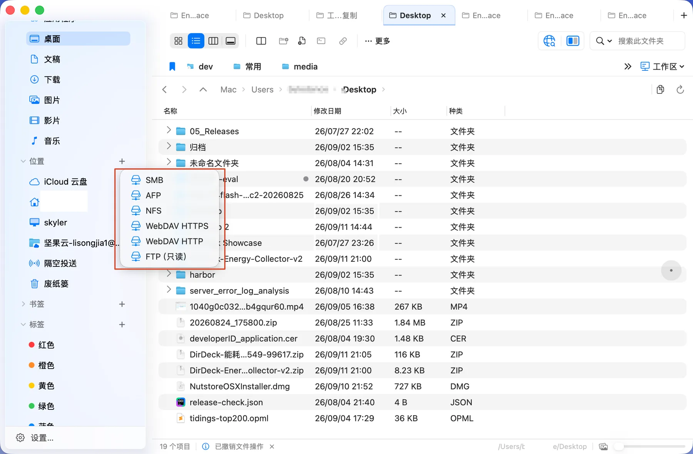

### 用什么打开，文件上就能看到

文件图标上可查看默认应用，右键即可修改同类文件的默认打开方式。常用文件应当交给哪个应用，由你决定。

<strong>查看默认打开方式</strong>

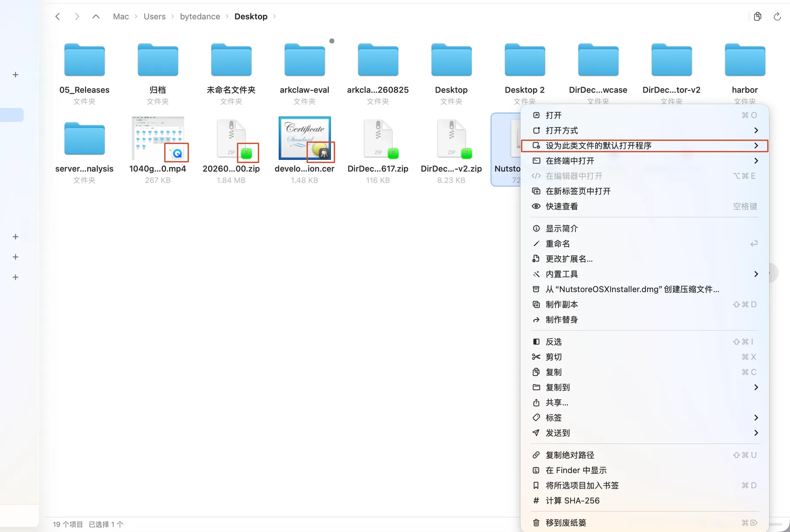

## 常用操作，按你的习惯摆放

十几种内置工具、几十个快捷右键，覆盖文件整理、图片处理、PDF 和压缩打包。需要的启用，暂时不用的收起来。

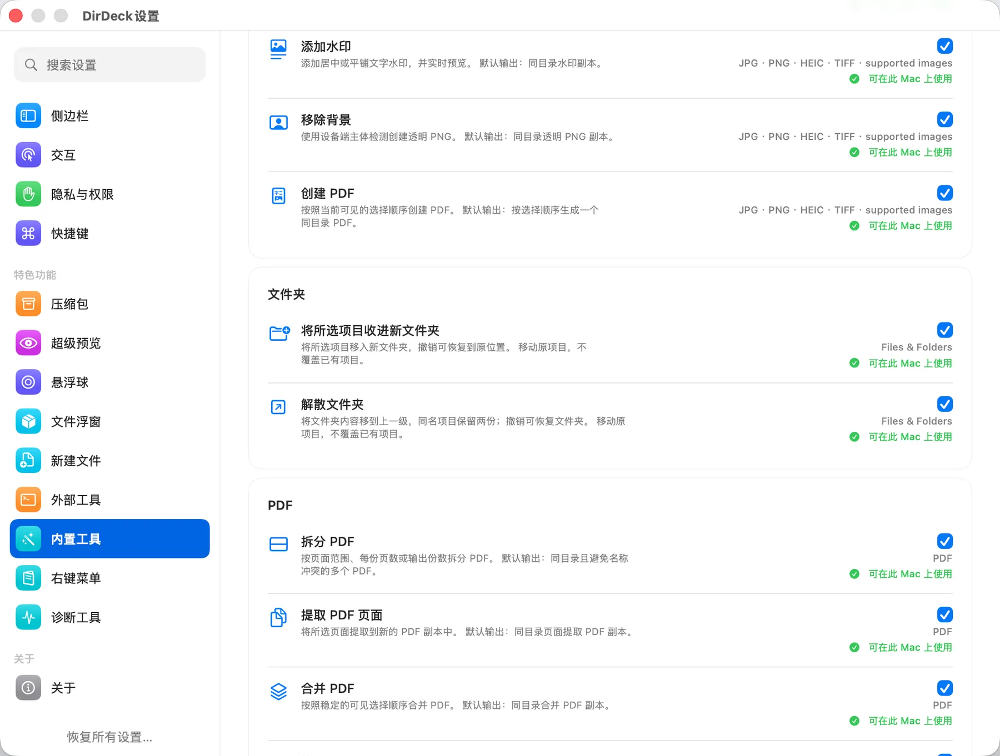

右键菜单随选中的文件类型提供合适操作：剪切、复制到、发送到、解压到、复制路径……还可以自行排序、分组和精简，把高频动作放到最顺手的位置。

<strong>查看右键菜单配置</strong>

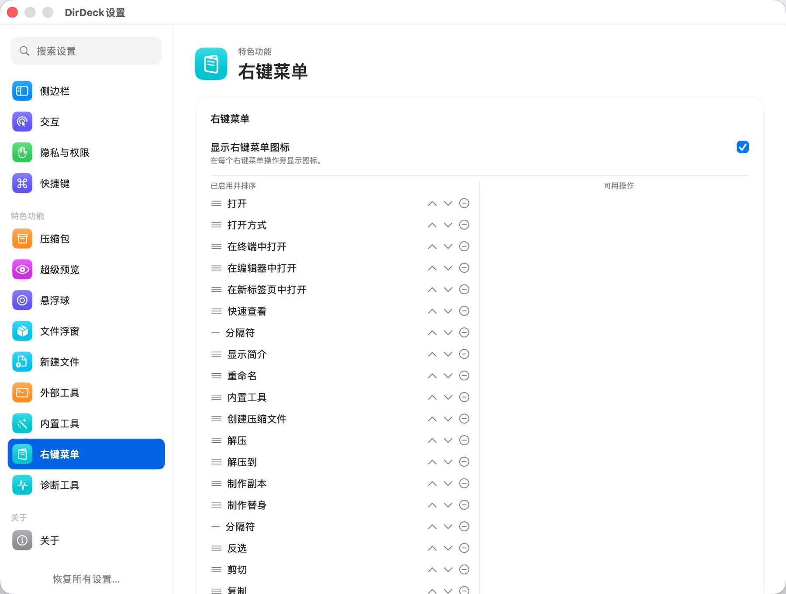

## 连按两次 D，全局文件快速搜

文件放在哪，不用全靠记忆。在 DirDeck 中连续按两次 **D**，输入文件名或关键词，跨文件夹查找目标，然后直接打开或定位。

**DD 快捷键在 DirDeck 内、未编辑文字时生效；全局搜索覆盖已授权访问的位置。** 无论当前浏览哪个目录，都可以从搜索开始。

[了解搜索与访问权限 →](https://dirdeck.com/support/)

## 让文件工作，从这里变顺手

**[从 Mac App Store 下载 DirDeck →](https://apps.apple.com/cn/app/dirdeck/id6794571378?mt=12)**

7 天全功能试用，试用本身不自动扣费。喜欢，再选择年度或永久使用权。购买条件与价格以 App Store 和购买页面为准。

需要 **macOS 15 或更高版本**。本页采用新版官网的产品界面展示；具体功能以当前安装版本为准。

- [产品官网](https://dirdeck.com/)：完整产品介绍
- [更新日志](https://dirdeck.com/changelog/)：查看各版本的变化
- [使用支持](https://dirdeck.com/support/)：权限、预览、试用与购买说明
- [隐私政策](https://dirdeck.com/privacy/) · [使用条款](https://dirdeck.com/terms/)

## 遇到问题，或有一个想法？

这里是 DirDeck 的官方产品介绍与社区反馈仓库。欢迎用中文或英文提交 Issue，我们可以在同一个地方讨论、补充信息并跟踪进展。

| 反馈类型 | 提交入口 |
| --- | --- |
| 某个操作没有按预期工作 | [报告问题](https://github.com/fuxiaoai/dirdeck-community/issues/new?template=bug_report.yml) |
| 想改善某个操作，或增加一项能力 | [提出功能建议](https://github.com/fuxiaoai/dirdeck-community/issues/new?template=feature_request.yml) |
| 想看看是否有人提出过相同问题 | [浏览已有 Issues](https://github.com/fuxiaoai/dirdeck-community/issues) |

报告问题时，请提供 **DirDeck 版本、macOS 版本、复现步骤，以及预期和实际结果**。截图或录屏能帮助说明问题；上传前请隐藏私人文件名、路径和其他敏感信息。

购买、订单或其他不适合公开讨论的事项，请发送邮件至 **[fxapps@163.com](mailto:fxapps@163.com)**。也可以先查看 [反馈指南](CONTRIBUTING.md)。

本仓库用于产品介绍、使用支持与反馈跟踪，不包含 DirDeck 应用源代码。

---

  <a href="https://dirdeck.com/">DirDeck 官网</a> ·
  <a href="https://dirdeck.com/en/">English website</a> ·
  <a href="mailto:fxapps@163.com">联系支持</a>

