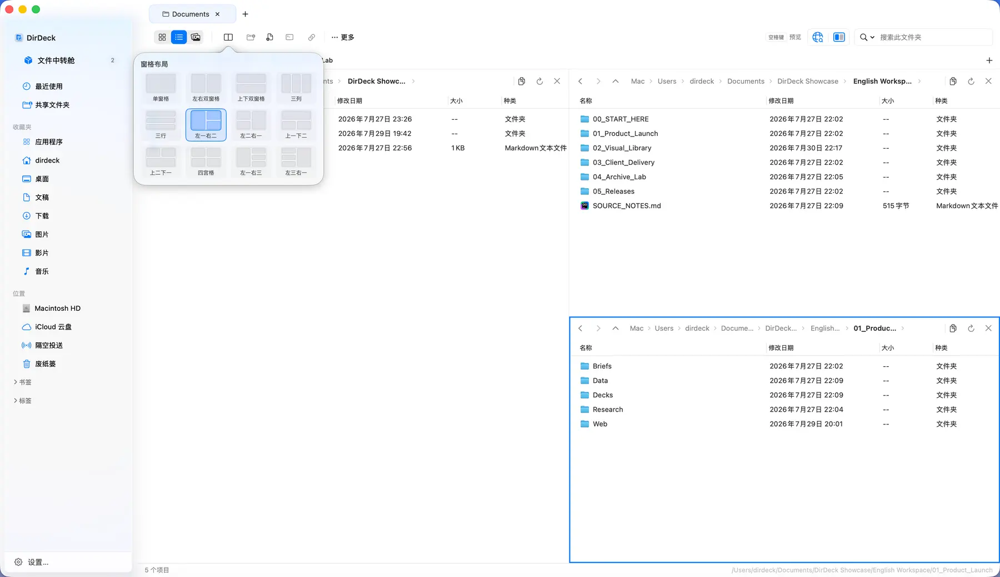
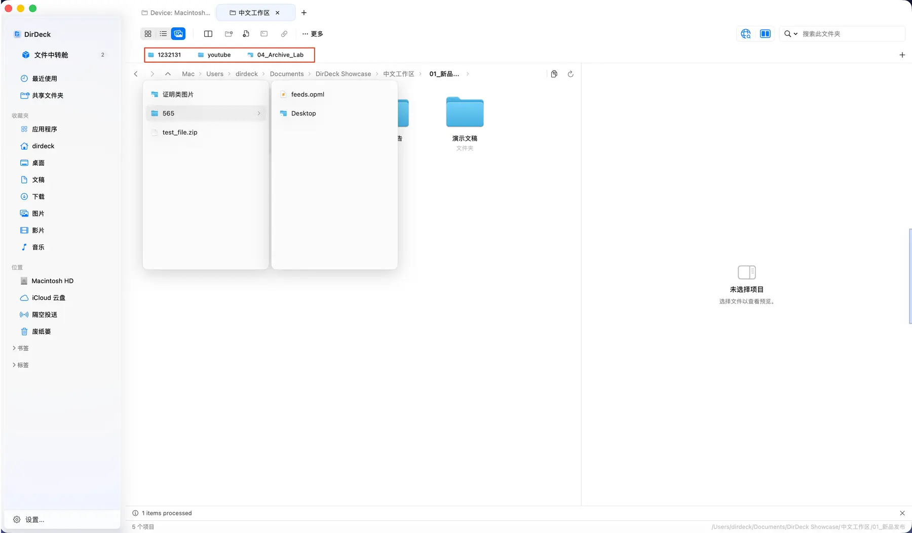
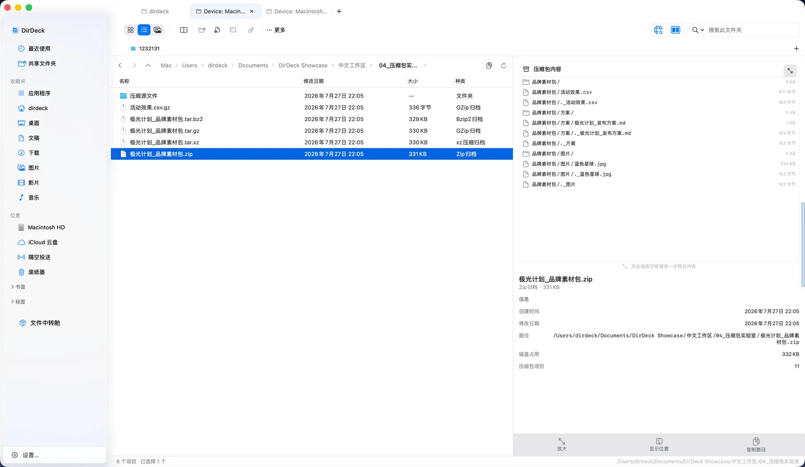
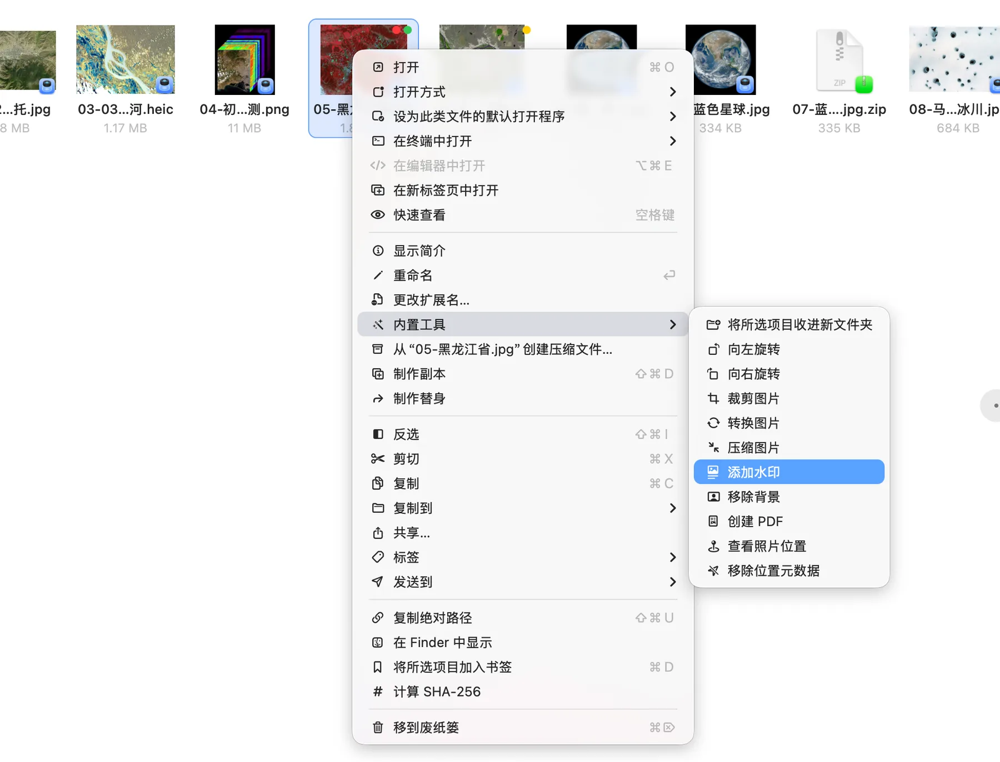
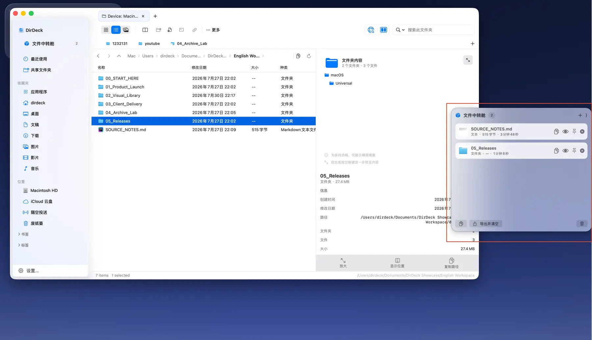

  

<h1 align="center">DirDeck</h1>

<strong>像管理浏览器一样，管理你的文件。</strong>

专为 Mac 打造的文件工作台。浏览、预览、整理与处理，在一个窗口里完成。

  <a href="https://dirdeck.com/">访问官网</a> ·
  <a href="https://apps.apple.com/cn/app/dirdeck/id6794571378?mt=12">Mac App Store 下载</a> ·
  <a href="https://github.com/fuxiaoai/dirdeck-community/issues/new/choose">反馈与建议</a>

macOS 15 或更高版本 · 原生 Mac 应用 · 无需注册账号

项目目录、下载文件、参考资料、待交付的素材，常常需要一起打开。DirDeck 用标签页留住每份工作，用多窗格把需要对照的位置并排放好。选中文件，就能接着预览、改名、处理或发送。

**少开几个窗口，少绕几次路径。把注意力留给手头的工作。**

## 常用位置，各就各位

一个项目一个标签页，在不同任务之间切换时，保留各自的浏览位置。需要整理素材或搬运文件，就切换到多窗格，把来源和目的地放在眼前，直接拖放。

- **多标签页**：多个位置分别打开，切换时不必重新查找。
- **12 种布局，1–4 个窗格**：按当前任务分配空间，每个窗格独立浏览。
- **多级收藏夹**：文件与文件夹都能收藏，按项目或用途嵌套分组，拖拽调整顺序。

## 先看清，再动手

收到一份素材包，不必先解压到桌面才知道里面有什么。选中文件夹或压缩包，按下 **空格**，从目录逐层展开，继续查看里面支持预览的文件。

Markdown 看排版，PDF 翻页面，Excel 切换工作表，图片与音视频直接查看。侧边预览适合边找边看，超级预览则为内容留出更大的空间。

支持文档、表格、文本、代码、图片、音视频与常见压缩格式。实际预览能力取决于文件格式、macOS 版本和已安装的预览组件；加密、损坏或超出处理限制的压缩包可能无法预览。

## 文件旁边，就是处理工具

给一批素材统一命名，把几页 PDF 单独交付，或将图片裁切成需要的尺寸。选好文件，就可以接着处理。

| 你要做的事 | DirDeck 中的工具 |
| --- | --- |
| 整理一批文件名 | 组合替换、前后缀、编号等规则，执行前预览新名称 |
| 处理图片 | 裁切、旋转、格式转换、压缩、移除背景、图片转 PDF |
| 整理 PDF | 拆分、合并、提取页面、旋转、压缩、导出图片 |
| 准备文件与路径 | 从模板新建文件、复制路径、在终端打开当前位置 |

<strong>查看图片工具</strong>

### 图片处理

工具栏和右键菜单也能按习惯调整：常用的放到手边，用不到的收起来。

## 文件先放这里，稍后接着整理

从几个文件夹收集资料时，可以先放进 **文件中转舱**，再一起处理。文件、文件夹、文本、图片和链接都能暂存，所有 DirDeck 窗口共用，随时预览、复制、拖出或导出。

已经知道目的地的文件，可以直接拖到另一个窗格，或通过「发送到」送往文件夹与收藏位置。

## 记得名字，就从搜索开始

在 DirDeck 内、未编辑文字时，连续按两次 **D**，输入文件名或路径关键词，跨文件夹寻找目标，再直接打开或定位。

搜索覆盖已授权访问的位置，并结合收藏夹、已打开的标签页和最近访问记录。快捷键在 DirDeck 内生效，文件访问遵循 macOS 的权限控制。

## 开始使用

**[从 Mac App Store 下载 DirDeck →](https://apps.apple.com/cn/app/dirdeck/id6794571378?mt=12)**

需要 **macOS 15 或更高版本**。功能界面可能随版本更新，请以当前安装版本为准。

- [产品官网](https://dirdeck.com/)：完整功能介绍与更多截图
- [更新日志](https://dirdeck.com/changelog/)：查看各版本的变化
- [使用支持](https://dirdeck.com/support/)：权限、预览、试用与购买说明
- [隐私政策](https://dirdeck.com/privacy/) · [使用条款](https://dirdeck.com/terms/)

## 遇到问题，或有一个想法？

这里是 DirDeck 的官方产品介绍与社区反馈仓库。欢迎用中文或英文提交 Issue，我们可以在同一个地方讨论、补充信息并跟踪进展。

| 反馈类型 | 提交入口 |
| --- | --- |
| 某个操作没有按预期工作 | [报告问题](https://github.com/fuxiaoai/dirdeck-community/issues/new?template=bug_report.yml) |
| 想改善某个操作，或增加一项能力 | [提出功能建议](https://github.com/fuxiaoai/dirdeck-community/issues/new?template=feature_request.yml) |
| 想看看是否有人提出过相同问题 | [浏览已有 Issues](https://github.com/fuxiaoai/dirdeck-community/issues) |

报告问题时，请提供 **DirDeck 版本、macOS 版本、复现步骤，以及预期和实际结果**。截图或录屏能帮助说明问题；上传前请隐藏私人文件名、路径和其他敏感信息。

购买、订单或其他不适合公开讨论的事项，请发送邮件至 **[fxapps@163.com](mailto:fxapps@163.com)**。也可以先查看 [反馈指南](CONTRIBUTING.md)。

本仓库用于产品介绍、使用支持与反馈跟踪，不包含 DirDeck 应用源代码。

---

  <a href="https://dirdeck.com/">DirDeck 官网</a> ·
  <a href="https://dirdeck.com/en/">English website</a> ·
  <a href="mailto:fxapps@163.com">联系支持</a>

